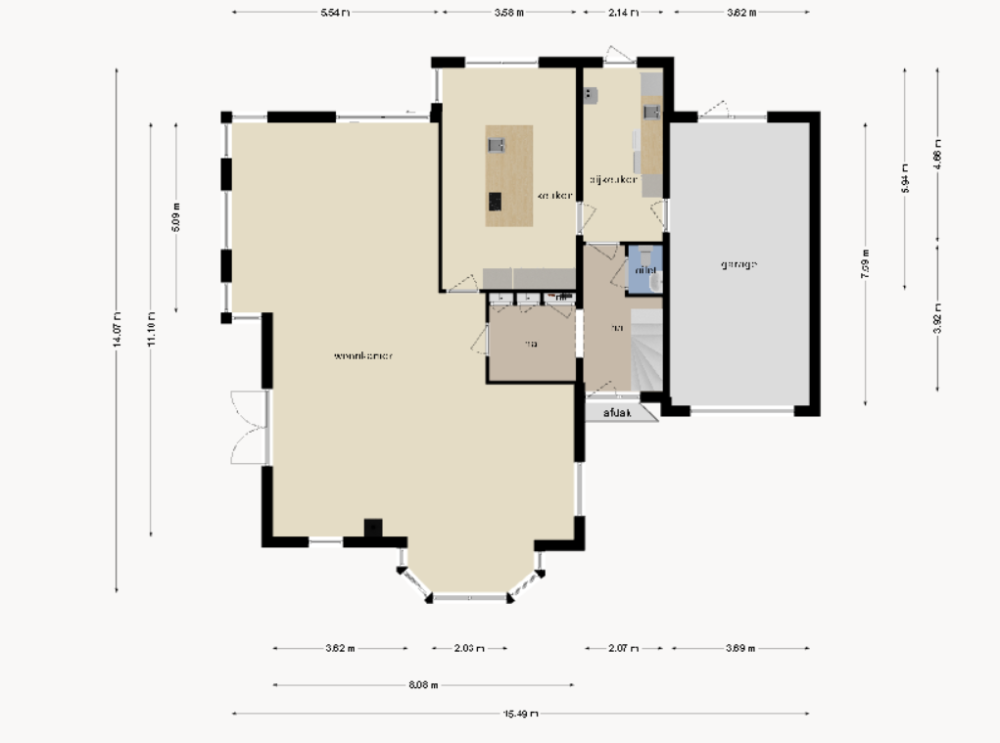
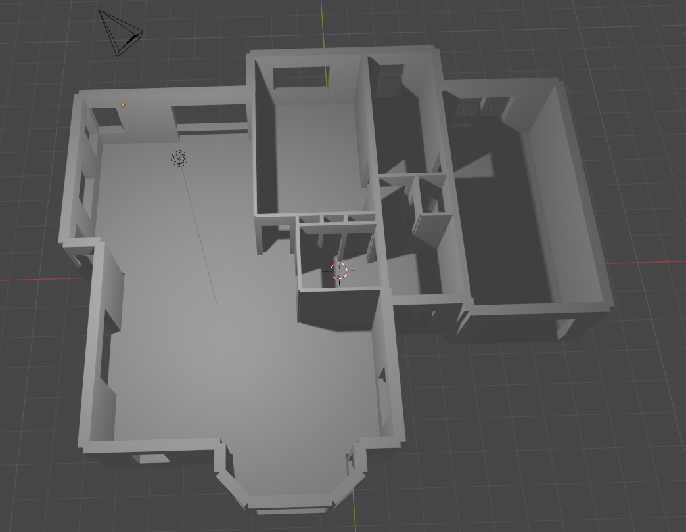

# funda-to-blender
Import a funda.nl floorplanner file and convert it into a 3D mesh in Blender.

Simply change the URL at the top of `main.py` and then open and run the script in Blender. Important: this will only work for Funda pages that have a floorplan available.

Input:

Output:

